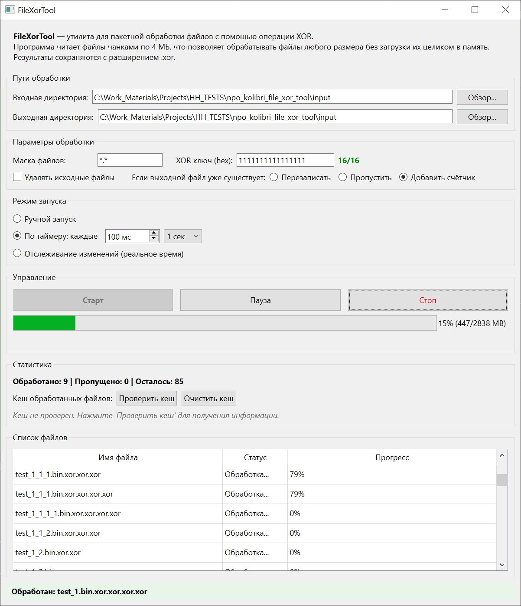

# FileXorTool




Утилита для пакетной бинарной модификации файлов с использованием операции XOR. 
Проект разработан в рамках тестового задания для НПО «Колибри». 

Основной упор сделан на **производительность при работе с большими файлами**, **отзывчивость интерфейса** и **современные практики сборки и деплоя** на C++.

## Ключевые технические решения

### 1. Работа с большими файлами (10GB+)
Программа не загружает файл в оперативную память. Чтение и запись осуществляются **чанками по 4 МБ** с использованием QFile::read() и QByteArray. Это гарантирует стабильное потребление памяти (~10-15 МБ) независимо от размера входных данных.

### 2. Многопоточность и отзывчивый UI
Обработка файлов выполняется параллельно через **QThreadPool** (8 потоков по умолчанию). Каждый файл обрабатывается в отдельном FileProcessor.
- **Управление состоянием (Пауза/Стоп):** Реализовано через std::atomic<bool>. Это позволяет потоку безопасно проверять флаги без блокировок (mutex) и оверхеда.
- **Прогресс-бар:** Обновляется через сигналы и слоты Qt, без зависания основного потока GUI.
- **Отдельные кнопки:** Старт, Пауза и Стоп работают независимо для гибкого управления процессом.

### 3. Кеш обработанных файлов
При повторном запуске программа **пропускает уже обработанные файлы** на основе SHA-256 хеша. Это ускоряет повторные запуски в разы.
- Кеш хранится в `.xor_tool_cache.json` в выходной директории
- Проверяется как хеш входного файла, так и ключ XOR
- Если выходной файл удалён, кеш автоматически инвалидируется

### 4. Современная система сборки и деплоя
- **CMake 3.21+:** Используется нативный file(GET_RUNTIME_DEPENDENCIES) для автоматического анализа зависимостей.
- **CPack:** Упаковка дистрибутива в ZIP или NSIS одной командой.
- **Just:** Единая точка входа для всех команд сборки, очистки и запуска.
- **GitHub Actions:** Автоматическая сборка и тестирование при каждом push.

### 5. Тестирование
- **QtTest:** Четыре раздельных тестовых набора:
  - `test_hex_parser` -- unit-тесты парсинга hex-ключа
  - `test_file_utils` -- unit-тесты работы с файлами
  - `test_file_cache` -- тесты хеширования и кеша
  - `test_worker` -- интеграционные тесты многопоточной обработки
- **test_stress** -- стресс-тесты в "боевых" условиях: параллельные модификации, удаления, блокировки файлов, нагрузка на QFileSystemWatcher

## Функциональность

- **Пакетная обработка:** Поддержка масок файлов (например, *.bin, testFile.bin).
- **Многопоточность:** Параллельная обработка 8 файлов одновременно через QThreadPool.
- **Гибкая настройка путей:** Отдельные директории для поиска входных файлов и сохранения результатов.
- **Три режима коллизий:** Перезапись, пропуск или добавление счётчика к имени файла.
- **Кеш:** Автоматический пропуск уже обработанных файлов на основе SHA-256 хеша.
- **Три режима запуска:** Ручной, по таймеру, отслеживание изменений в реальном времени.
- **Управление процессом:** Отдельные кнопки для приостановки, возобновления и полной остановки обработки.
- **Детальный прогресс:** Таблица файлов с индивидуальным прогрессом по каждому файлу.
- **Безопасное завершение:** Корректная остановка потока и освобождение ресурсов при закрытии окна приложения.

## Сборка и запуск

Для сборки проекта используется утилита **Just**. Все зависимости для Windows управляются через **MSYS2**.

### 1. Настройка окружения (MSYS2)
Если вы собираете проект на чистой системе, установите все необходимые пакеты (компилятор, CMake, Qt 6, NSIS, Just) одной командой. 

**Важно:** запускайте терминал MSYS2 MinGW64 от имени **Администратора**, затем выполните:
```bash
just setup-msys
```
Эта команда обновит систему и установит пакеты: mingw-w64-x86_64-toolchain, cmake, qt6-base, qt6-tools, nsis и just.
### 2. Команды Just
Все команды выполняются в обычном терминале MSYS2 MinGW64 (или Git Bash) в корне проекта.
| Команда | Описание |
| --- | --- |
| just build | Сборка Debug-версии (для разработки и отладки в VS Code). |
| just run | Сборка и запуск Debug-версии. |
| just build-release | Сборка Release-версии. |
| just install | Установка Release-версии в папку dist/. |
| just package | Сборка Release и упаковка в архив через CPack. |
| just clean | Очистка артефактов Debug-сборки (сохраняет кеш CMake). |
| just clean-all | Полная очистка папок build/ и dist/. |
| just test | Запуск всех тестов. |
| just test-fast | Запуск только быстрых unit-тестов (без больших файлов). |
| just test-worker | Запуск интеграционных тестов Worker. |
| just test-stress | Запуск стресс-тестов (боевые условия). |
| just test-operations | Запуск тестов операций (XOR, NOT, ROT). |
| just test-gui | Запуск GUI-тестов. |

### 3. Отладка в VS Code
Проект полностью настроен для работы с расширениями **C/C++** и **CMake Tools**.
1. Откройте проект в VS Code.
2. В статус-баре выберите кит **MinGW 64-bit**.
3. Нажмите **F7** для сборки или **F5** для запуска отладчика (GDB).

### 4. CI/CD
Проект настроен для автоматической сборки и тестирования через GitHub Actions. При каждом push или pull request:

    Устанавливается MSYS2 с необходимыми пакетами
    Собирается Debug и Release версии
    Запускаются все тесты
    Создаётся ZIP-архив (доступен в артефактах)

### 5. Тестирование
Проект покрыт тестами на пяти уровнях:
- **test_operations** -- 21 тест для всех операций (XOR, NOT, ROT) и фабрики
- **test_hex_parser** -- unit-тесты парсинга hex-ключа
- **test_file_utils** -- unit-тесты работы с файлами и коллизиями имён
- **test_file_cache** -- тесты хеширования и кеша
- **test_worker** -- интеграционные тесты Worker с data-driven тестами режимов коллизий
- **test_stress** -- стресс-тесты в "боевых" условиях
- **test_mainwindow** -- GUI-тесты с полной проверкой состояний через фреймворк `MainWindowTester` и `GuiState`

## Стресс-тестирование
Проект проходит стресс-тесты, имитирующие реальные "боевые" условия:
- **Параллельные модификации** -- файлы меняются во время обработки
- **Удаление файлов** -- файлы исчезают во время обработки
- **Блокировка файлов** -- файлы открыты другими процессами
- **Нагрузка на QFileSystemWatcher** -- хаотичное создание/изменение/удаление файлов
- **Полный хаос** -- все вышеперечисленное одновременно

Программа не падает (нет segfault, нет deadlock) даже в экстремальных условиях.

## 6. Дистрибуция и упаковка (CPack)

При выполнении just package CMake генерирует дистрибутив, содержащий всё необходимое для запуска на чистой Windows-машине без установленного MSYS2 или Qt.

- **Форматы:** По умолчанию создается **ZIP-архив**. Если в системе установлен NSIS (он ставится через just setup-msys), можно также генерировать полноценный **.exe установщик**, изменив CPACK_GENERATOR в CMakeLists.txt на "ZIP;NSIS".
- **Зависимости MinGW:** libgcc и libstdc++ вшиты в .exe статически. Динамически подтягивается только libwinpthread-1.dll и транзитивные зависимости Qt.
- **Зависимости Qt:** Автоматически собираются утилитой windeployqt и нативным скриптом CMake file(GET_RUNTIME_DEPENDENCIES).
- **Расположение:** Готовые архивы сохраняются в build/release/_CPack_Packages/, а распакованная версия -- в dist/.

## 7. Структура директорий
Проект четко разделяет процессы разработки и релизной сборки:

- **build/debug/** -- артефакты Debug-сборки. Используется по умолчанию в VS Code для повседневной отладки (F5/F7).
- **build/release/** -- артефакты Release-сборки. Используется для финальной компиляции и упаковки.
- **build/release/_CPack_Packages/** -- здесь CPack генерирует готовые архивы (ZIP или NSIS).
- **dist/** -- сюда устанавливаются файлы при выполнении just install. Представляет собой готовую распакованную версию программы, которую можно сразу запускать.

## 8. Структура исходного кода
``` bash
.
├── CMakeLists.txt                          # Конфигурация сборки, линковки, зависимостей и CPack
├── justfile                                # Скрипты автоматизации (кроссплатформенные)
├── README.md
├── .github/
│   └── workflows/
│       └── build-and-test.yml              # GitHub Actions CI/CD
└── src/
    ├── main.cpp                            # Точка входа, инициализация QApplication
    ├── mainwindow.h/cpp                    # UI, валидация настроек, оркестрация Worker
    ├── worker.h/cpp                        # Оркестратор многопоточной обработки, управление QThreadPool
    ├── file_processor.h/cpp                # Задача обработки одного файла (QRunnable)
    ├── file_result.h                       # Структура результата обработки + enum ConflictMode
    ├── file_utils.h/cpp                    # Утилиты работы с файлами (уникальные имена, коллизии)
    ├── file_cache.h/cpp                    # Кеш обработанных файлов на основе SHA-256
    ├── operations/
    │   ├── ibinary_operation.h             # Интерфейс для всех операций (паттерн Strategy)
    │   ├── binary_operations.h/cpp         # Реализации операций XOR, NOT, ROT
    │   └── operation_factory.h/cpp         # Фабрика для создания операций
    ├── utils/
    │   └── hex_parser.h/cpp                # Парсер шестнадцатеричного кода (используется XorOperation)
    └── tests/
        ├── test_helpers.h/cpp              # Общие helper-функции для тестов
        ├── test_gui_helpers.h/cpp          # Фреймворк для GUI-тестирования (MainWindowTester, GuiState)
        ├── test_operations.cpp             # Тесты операций (XOR, NOT, ROT) и фабрики
        ├── test_worker.cpp                 # Интеграционные тесты Worker (data-driven)
        ├── test_mainwindow.cpp             # GUI-тесты с проверкой состояний
        └── test_stress.cpp                 # Стресс-тесты в "боевых" условиях
```

### 9. Поддержка нескольких операций через интерфейс
Пока нельзя выбирать операцию, но она вынесена в интерфейс `IBinaryOperation`. Реализованы три операции:
- **XOR** -- побитовое исключающее ИЛИ с ключом
- **NOT** -- побитовая инверсия
- **ROT** -- циклический сдвиг байта

Создание операций инкапсулировано в `OperationFactory` (паттерн Factory). UI передаёт только название операции и параметры, Worker создаёт операцию через фабрику. Это позволяет добавлять новые операции без изменения `FileProcessor`.

### 10. Игнорирование системных файлов
Программа автоматически игнорирует файл кеша `.xor_tool_cache.json` при обработке, даже если маска охватывает все файлы (`*.*`). Это предотвращает ошибки при попытке обработать собственный файл кеша. 

## Лицензия
Проект создан в качестве тестового задания. Исходный код предоставляется «как есть».